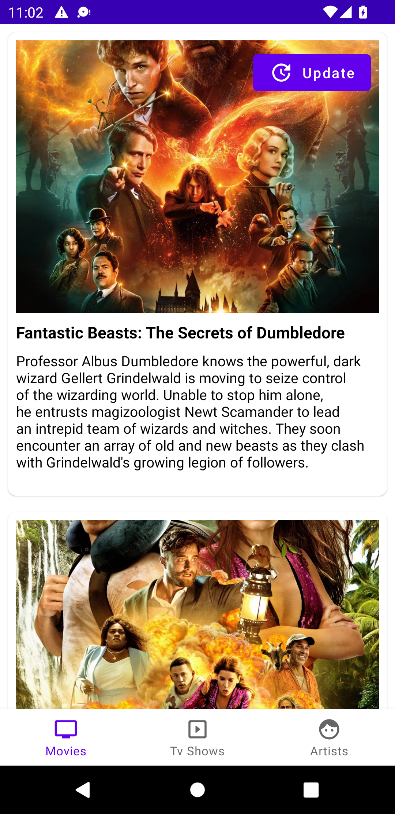
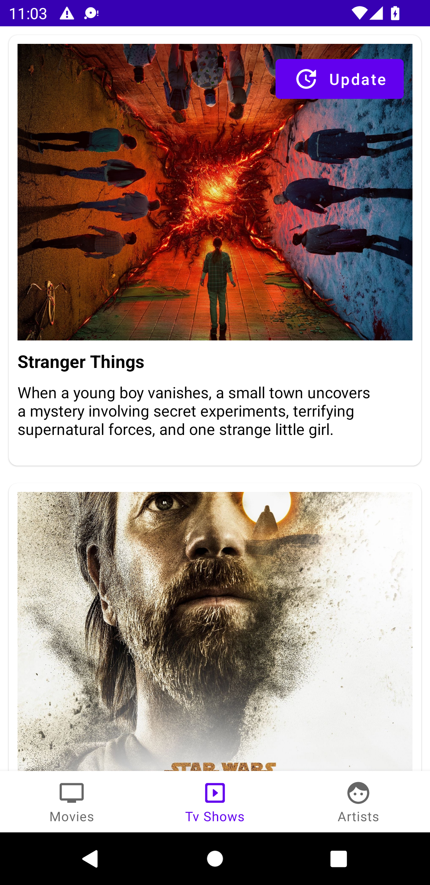
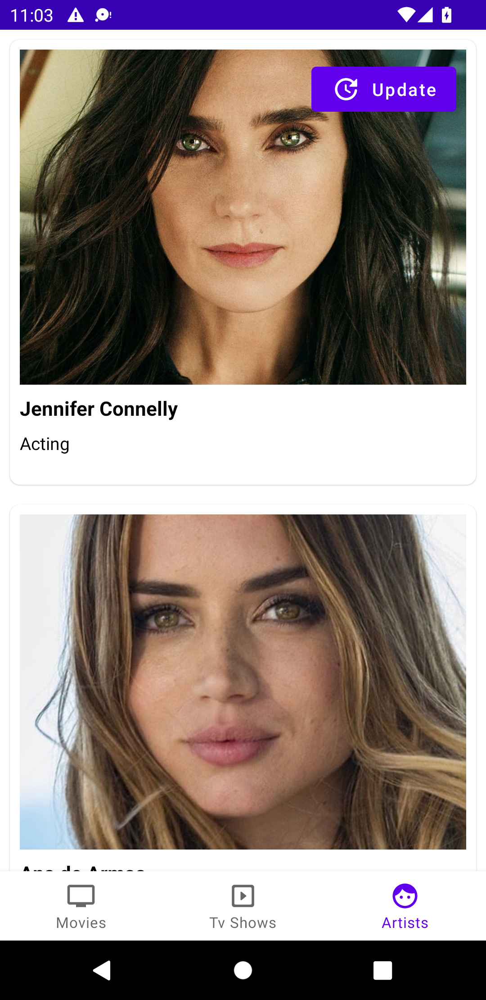

# Movies App

A movies app was built with TMDB API
This app was built with mvvm architecture, dagger, retrofit, room database, and navigation components.
This app displays popular movies, tv-shows and artists.

Sign up and get your Api key from https://www.themoviedb.org
Open your build.gradle (module) file and paste your api key and base url e.g
| MY_KEY = "mykey" |
| MY_URL = "https://api.themoviedb.org/3/" |

## Screenshots

| Popular Movies Screen | Popular Tv Shows Screen | 
|    :---:     |     :---:      |  
|    |    |

| Popular Artist Screen | 
|    :---:     |     
| 

## Contributions

Feel free to contribute to this project.